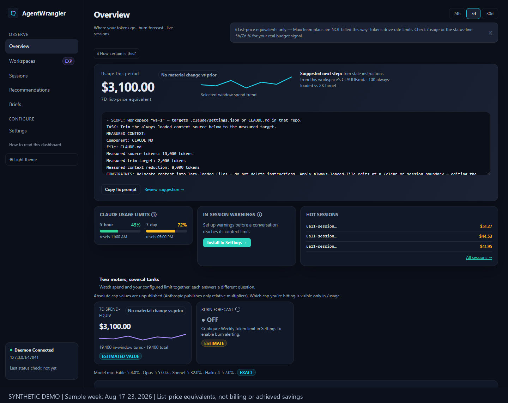
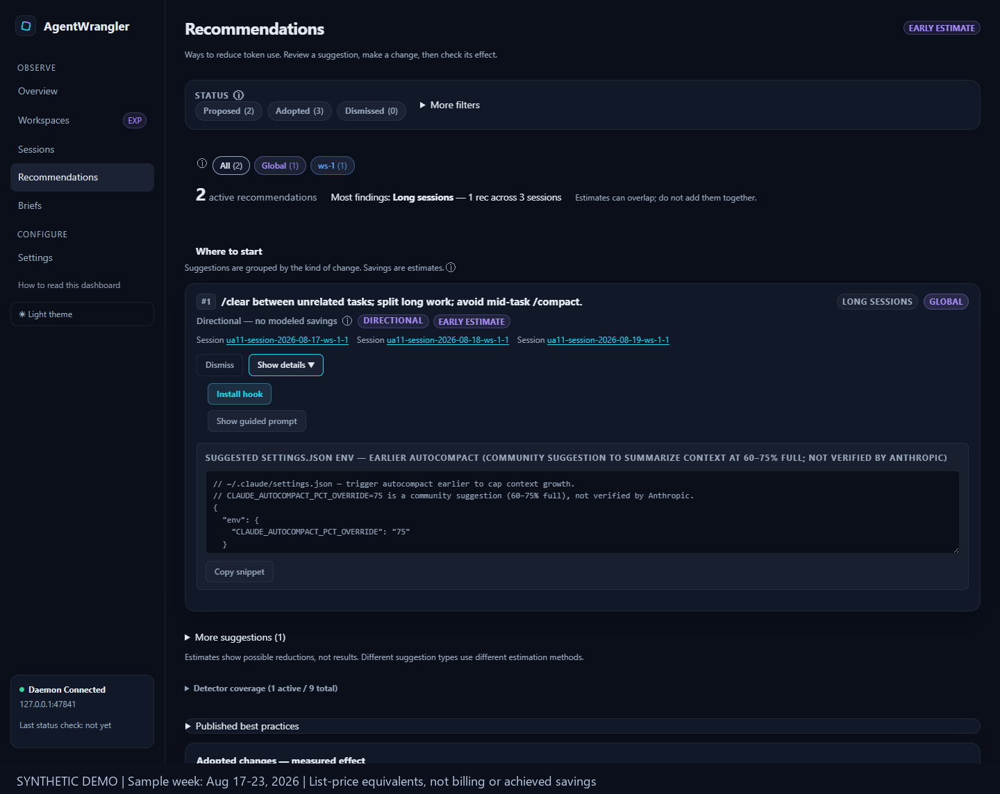
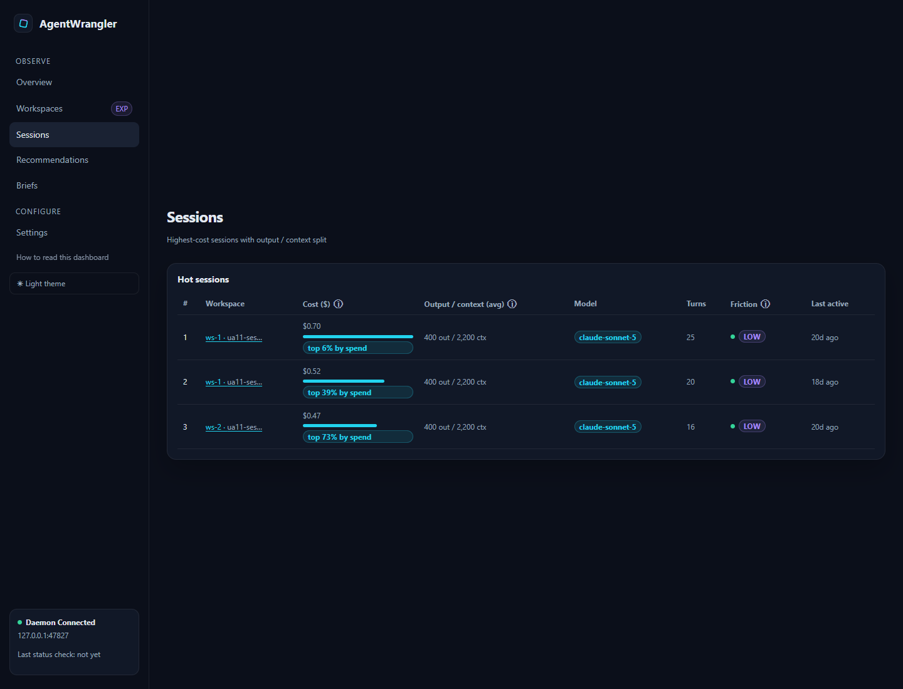
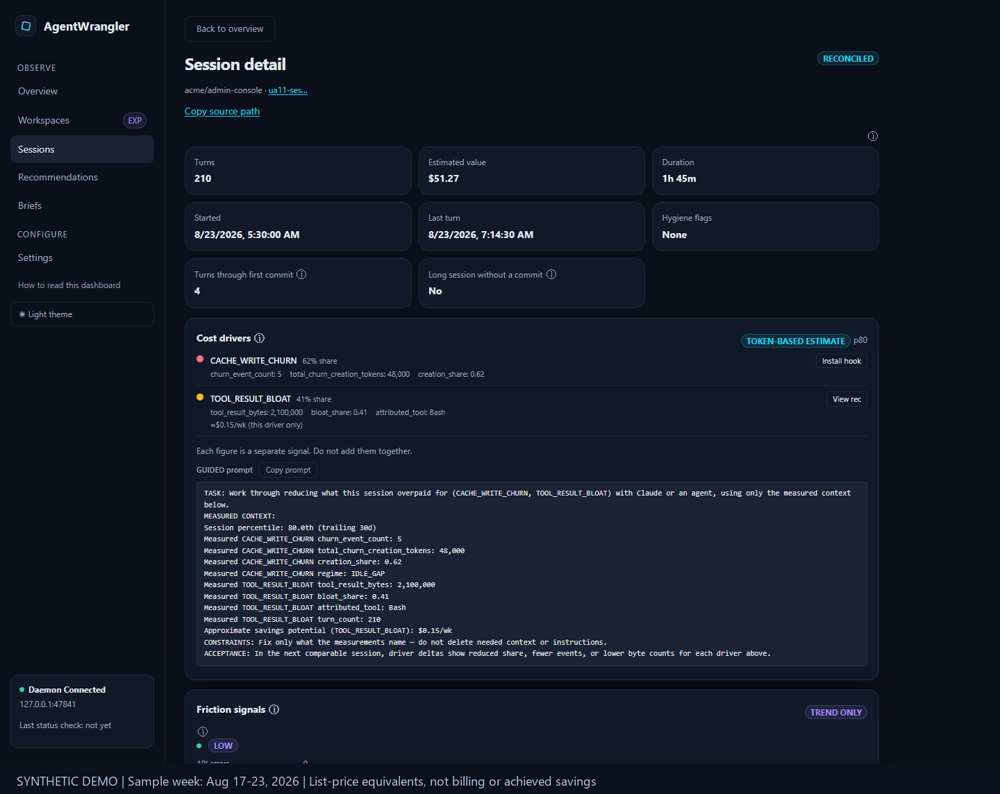
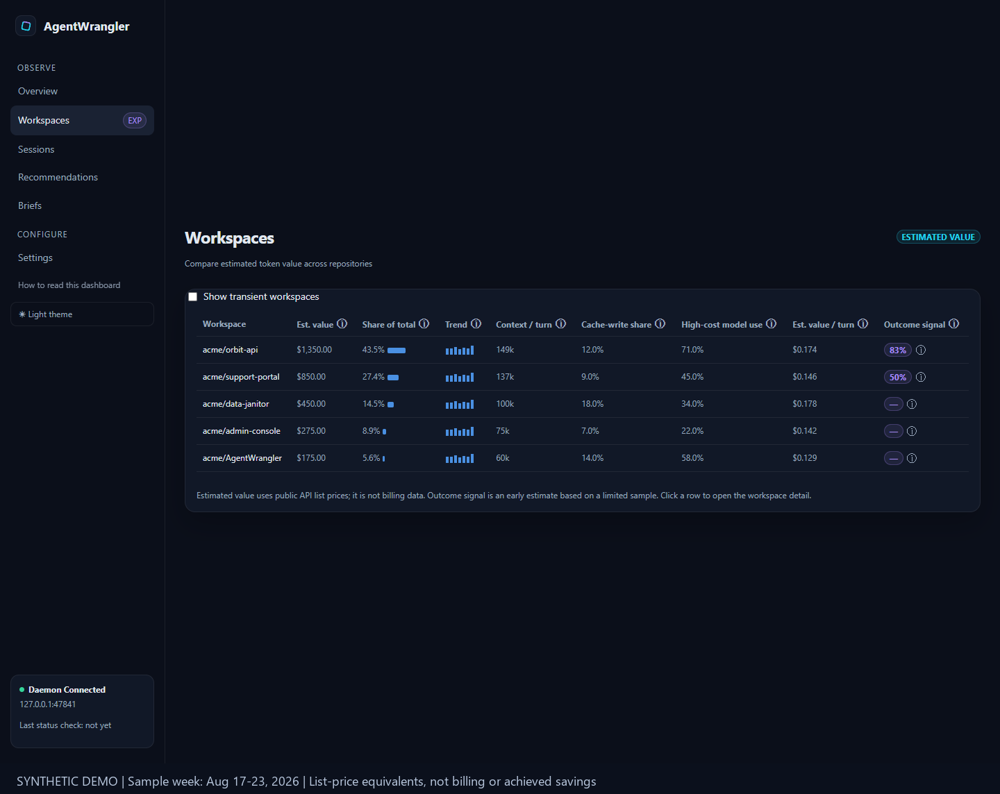
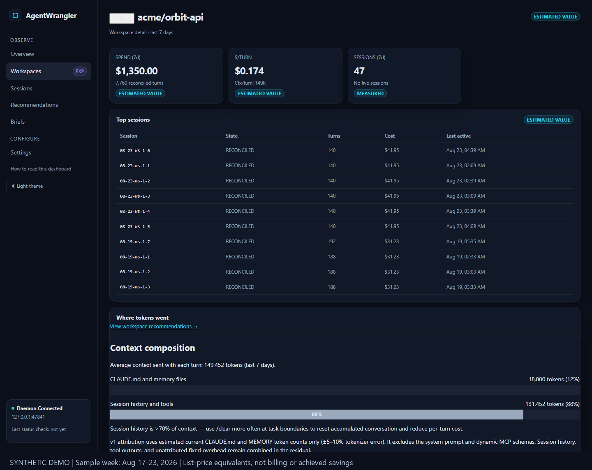
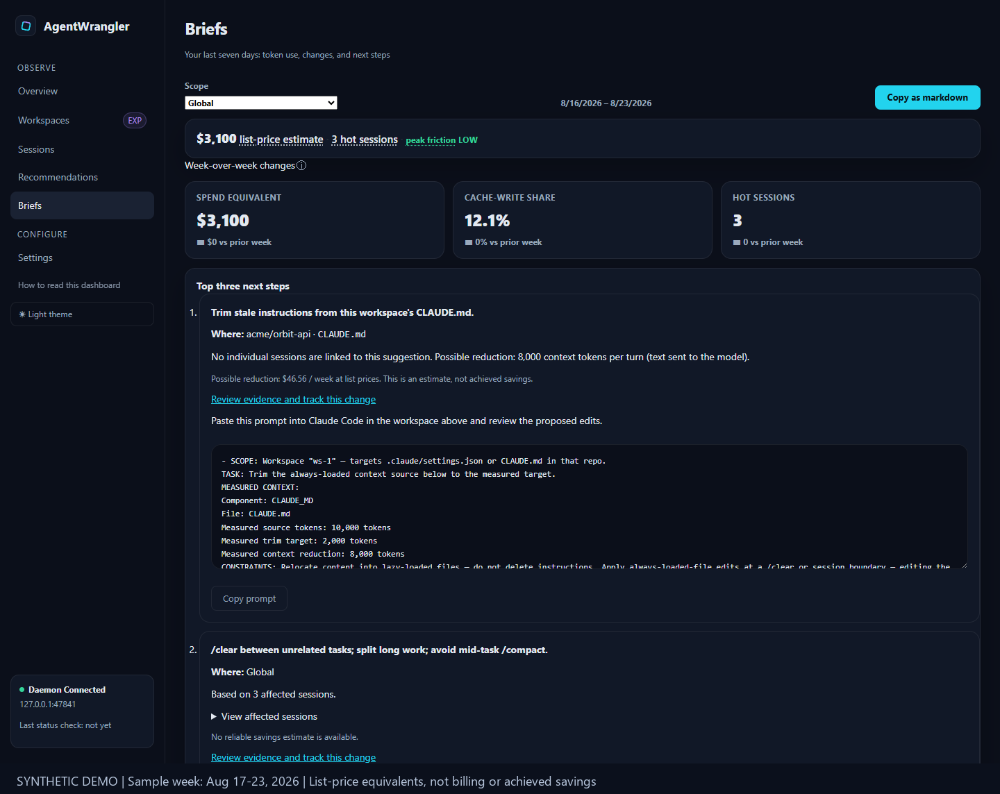

<p align="center">
  
</p>

<h1 align="center">AgentWrangler</h1>

<p align="center">
  <b>See where your Claude Code tokens go — and whether the work actually shipped.</b><br>
  Local-first observability for Claude Code: token spend, session outcomes, waste detection,
  and installable guardrails. Runs entirely on your machine.
</p>

<p align="center">
  <a href="https://www.npmjs.com/package/agentwrangler"></a>
  <a href="https://github.com/Doogit/AgentWrangler/actions/workflows/ci.yml"></a>
  <a href="https://img.shields.io/node/v/agentwrangler"></a>
  <a href="LICENSE"></a>
</p>


<!--
  All screenshots and the demo GIF in this README are captured from a SANITIZED instance
  (Vite test-mode fixtures — anonymized names, no live data) so no real workspace/repository
  names or paths are committed (SEC-101). Regenerate against `npx vite --mode test`.
-->

## Why

Claude Code tells you almost nothing about where your token budget goes. Sessions balloon,
caches miss, background agents idle — and you find out when you hit the rate limit.
AgentWrangler reads the transcripts Claude Code already writes to your disk and answers three
questions:

- **Where did the tokens go?** Per-model, per-workspace, per-session spend with cache economics.
- **Did the work ship?** Sessions are linked to the pull requests they merged or closed.
- **What should I change?** Ranked waste-source detectors with modeled savings — and one-click
  guardrail hooks that warn *inside* Claude Code before waste happens.

No cloud backend, no telemetry, no account. A daemon on `127.0.0.1`, a dashboard in your
browser, and a SQLite file in your home directory.

## Quick start

```sh
npx agentwrangler@latest
```

That's it — requires Node **22–24**. The daemon starts on `http://127.0.0.1:47821`, opens your
browser, and scans your `~/.claude/projects` transcripts in the background; the dashboard
appears immediately and fills in as the scan completes.

More options (install from source, GitHub outcomes sync, environment variables):
**[Getting started →](docs/getting-started.md)**

## Features

### Overview — verdict first, details on demand

One screen answers "how bad is it this week": a spend verdict with trend, your top waste
source with a copyable fix prompt, live rate-limit gauges (5-hour and 7-day), a burn forecast
against your calibrated weekly limit, hot sessions, cache efficiency, and per-model
context-per-turn tiles.



### Recommendations — waste-source detectors, ranked by impact

Ten detector families watch your sessions for the patterns that actually burn tokens: cache
misses (the biggest single lever), session hygiene, retry/redundant-read loops, tool-result
bloat, model routing, idle background sessions, and more. Each recommendation shows modeled
weekly savings, a confidence tier, and a concrete action — install a hook, copy a config
snippet, or copy a guided prompt straight into Claude Code. Adopted changes flow into an
**impact ledger** that tracks the measured effect, and modeled savings are never counted as
achieved.



### Installable guardrails — warnings inside Claude Code, before the waste

Five small hooks you can install from the dashboard (directly, or via a copyable prompt that
Claude Code applies itself):

| Guardrail | What it does |
|---|---|
| **Context-budget warning** | Warns when a session's context crosses your soft/hard thresholds |
| **Loop guard** | Flags repeated identical tool failures before they spiral |
| **Burn alert** | Catches idle sessions still burning tokens in the background |
| **Pre-compaction checkpoint** | Nudges a checkpoint before `/compact` destroys recoverable state |
| **Dangerous-command block** | Denies a configurable list of destructive shell commands |

The in-session guards only warn — they never block a tool call. Thresholds are tunable from
Settings, and every hook has a matching one-click uninstall.

### Sessions — who spent it, and on what

The highest-cost sessions ranked with their output-to-context split, model, friction band
(API errors, tool failures, compactions, interrupts), and a "top X% by spend" self-percentile
chip. Drill into any session for a turn-by-turn timeline, its cost drivers (which detectors
fired and how hard), and a guided fix prompt built only from measured numbers.



<details>
<summary>Session detail view</summary>


</details>

### Workspaces — spend efficiency by repository

Every repo you run Claude Code in, with spend share, trend, context-per-turn, cache-write
share, Opus share, and $/turn. With a GitHub token configured, sessions are linked to the PRs
and commits they produced — so you can see cost-per-merged-PR, not just cost.



<details>
<summary>Workspace detail view</summary>


</details>

### Weekly brief — one page, three decisions

The week in one screen: spend verdict, what changed vs. last week, the top actions to take —
with a **Copy as Markdown** button so the whole brief drops into a standup note or a message.



### Honest numbers, labeled as such

Every metric carries an honesty-tier chip — `EXACT`, `LIST_EQUIV`, `MODELED`, `PROXY`,
`DIRECTIONAL`, `EXPERIMENTAL` — so you always know what is measured versus estimated. Dollar
figures are list-price *equivalents* (subscription plans aren't billed per token; tokens drive
rate limits), and the built-in glossary ("How to read this dashboard") defines every
key metric in plain language. The full tour: **[Dashboard tour →](docs/dashboard-tour.md)**

## Privacy — local-only by design

- The daemon binds to **`127.0.0.1`** only. No cloud, no telemetry, nothing phones home.
- Only **aggregates, ids, counts, and structural anchors** are stored — never raw transcript
  or PR content (the SEC-101 privacy invariant, enforced in code and CI).
- The optional GitHub token is read locally, never logged, never persisted to the DB.
- The only network calls to Anthropic are two **opt-in** calibration features, both off by
  default.

Full details, including exactly what is and isn't stored: **[Privacy model →](docs/privacy.md)**

## Configuration

Everything is optional with sensible defaults — port, DB path, scan roots, GitHub token, and
more are environment variables documented in [Getting started](docs/getting-started.md#configuration)
and [`.env.example`](.env.example).

## Documentation

| Page | What's in it |
|---|---|
| [Getting started](docs/getting-started.md) | Install paths, optional setup, configuration, troubleshooting |
| [Dashboard tour](docs/dashboard-tour.md) | Every tab in depth, plus the metric vocabulary |
| [Privacy model](docs/privacy.md) | What's stored, what never is, and the two opt-in exceptions |
| [Architecture](docs/planning/AgentWrangler_Technical_Architecture_v4_5_0.md) | Daemon, ingestion, detector, and query design |
| [Data model & metrics](docs/planning/AgentWrangler_Data_Model_and_Metrics_v2.md) | SQLite schema and metric definitions |
| [Contributing](.github/CONTRIBUTING.md) | Dev setup, checks, PR expectations |
| [Security policy](.github/SECURITY.md) | Threat model and how to report a vulnerability |

## Limitations

- Reads Claude Code's JSONL transcript format; an upstream format change can require an
  ingestion update.
- Tested on Windows; macOS/Linux are believed working — reports welcome.
- Single local user by design — no multi-user or team-aggregation mode.
- Outcome linkage needs a read-only GitHub token; without one the feature stays inert (and
  Settings says so — nothing fails silently).

## License

[Apache 2.0](LICENSE) © 2026 AgentWrangler contributors.
See [CONTRIBUTING.md](.github/CONTRIBUTING.md), [SECURITY.md](.github/SECURITY.md), and
[CODE_OF_CONDUCT.md](.github/CODE_OF_CONDUCT.md).
