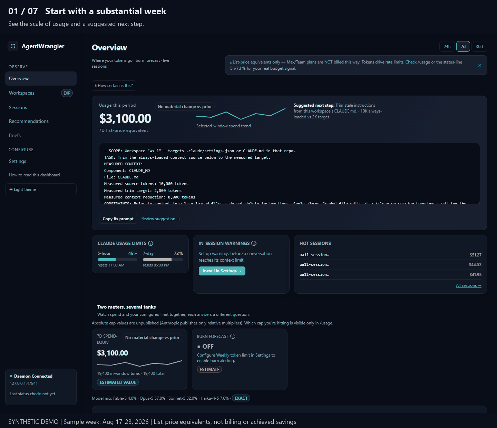

# AgentWrangler

Local-first observability for Claude Code that **joins your token spend to the pull requests it
actually merged or closed** — entirely on your machine — and ships **installable guardrails** (a
dangerous-command block, a pre-compaction checkpoint, a context-budget warning) you turn on from the
dashboard. See where your agent budget goes, whether the work shipped, and cut the waste.

## Local-only — your data never leaves your machine

AgentWrangler runs entirely on your computer: a daemon bound to **`127.0.0.1`** and a dashboard in
your browser that talks only to that loopback address. **No cloud backend, no telemetry, nothing
phones home.** It reads your local Claude Code transcripts, stores only aggregates in a local SQLite
file (`~/.agentwrangler/db.sqlite`), and never persists raw transcript or PR content — only counts,
ids, and structural anchors (the SEC-101 privacy invariant). An optional GitHub token, used only for
the outcomes feature, is read locally, never logged, and never leaves your machine.

**Privacy exception (opt-in):** `npm run evidence:judge-g2 -- --execute` is the only path where PR
content leaves the machine. It calls the Claude API with your local Claude Code OAuth credential to
adjudicate G2 deferral findings, and runs only when `g2_claude_judge_opt_in` is enabled; otherwise it
refuses to run. No rationale text is persisted.



<!--
  Captured from a SANITIZED instance (Vite test-mode fixtures — anonymized names, no
  live data) so no real workspace/repository names/paths are committed (SEC-101).
  Regenerate with the ce-demo-reel skill against `npx vite --mode test`.
-->

## Quick start

Requirements: **Node `>=22 <25`** and npm.

```sh
git clone https://github.com/Doogit/AgentWrangler && cd AgentWrangler
npm ci
npm run build:ui       # build the dashboard
npm run daemon         # starts the daemon and opens your browser
```

Then open **http://127.0.0.1:47821** (the daemon opens it for you unless `AW_NO_OPEN=1`).

After installing dependencies you can also do it in one step:

```sh
npm ci                 # required first — the CLI runs via tsx, a devDependency
npx agentwrangler      # builds the UI if needed, then launches the daemon + browser
```

On first launch the daemon binds the port immediately and serves a loading page, then scans your
`~/.claude/projects/**/*.jsonl` transcripts in the background — the dashboard appears right away and
fills in as the scan completes, so a large history won't block the page from opening.

## Optional setup

- **GitHub outcomes sync** — links sessions to the PRs/commits they produced. Provide a read-only
  GitHub PAT via the `AW_GITHUB_TOKEN` environment variable (works on all platforms). On Windows you
  may instead store it in Credential Manager as `AgentWrangler-GithubToken`. Without a token the
  outcomes feature stays inert and Settings tells you so — nothing fails silently.
- **Usage reader** — reads your Claude Code OAuth credentials locally to calibrate the weekly limit
  and burn forecast. Sign in through Claude Code as usual; Settings shows the reader status.
- **Context-budget hook** — an optional PreToolUse hook that warns before long sessions balloon.
  Install it from the Settings page (or `npm run install-hook`).

## Configuration (environment variables)

All are optional; sensible defaults apply. See [`.env.example`](.env.example) for the full list.

| Variable | Purpose | Default |
|---|---|---|
| `AW_PORT` | Daemon HTTP port | `47821` |
| `AW_DB_PATH` | SQLite database path | `~/.agentwrangler/db.sqlite` |
| `AW_SCAN_ROOT` | Transcript corpus to scan | `~/.claude/projects` |
| `AW_UI_ROOT` | Directory the built UI is served from | `<repo>/dist/ui` |
| `AW_GITHUB_TOKEN` | Read-only GitHub PAT for outcomes sync | *(unset)* |
| `AW_NO_OPEN` | Set to `1` to not auto-open the browser | *(unset)* |

## What it measures

AgentWrangler ingests your transcripts and surfaces cost trends, cache-efficiency, session hygiene
findings (e.g. long sessions never `/clear`ed, limit-burn risk), and — with a GitHub token — outcome
linkage between sessions and the work they shipped. Numbers are cap-weighted and honesty-tiered: the
UI is explicit about what is measured versus estimated, and never invents a proxy it can't ground.
Definitions live in [`docs/planning/AgentWrangler_Data_Model_and_Metrics_v2.md`](docs/planning/AgentWrangler_Data_Model_and_Metrics_v2.md).

## Limitations

- **Platform support.** Tested on Windows; macOS/Linux are believed working — reports welcome.
- **Transcript-format coupling.** AgentWrangler reads Claude Code's JSONL transcript format; a change
  to that format upstream can require an ingestion update.
- **Outcomes credential sources.** The cross-platform path is `AW_GITHUB_TOKEN`; the OS credential
  store integration currently covers Windows Credential Manager only (macOS/Linux keychain is a
  follow-on).
- **Single local user.** It observes one machine's Claude Code history; there is no multi-user or
  team-aggregation mode by design.

## License

Licensed under the [Apache License 2.0](LICENSE). Copyright 2026 AgentWrangler contributors.

See [CONTRIBUTING.md](CONTRIBUTING.md) to build and test, [SECURITY.md](SECURITY.md) to report a
vulnerability, and [CODE_OF_CONDUCT.md](CODE_OF_CONDUCT.md).

## Documentation index

| Path | Purpose |
|---|---|
| `docs/adr/ADR-100-stack.md` | Accepted MVP stack: Node 22 LTS + TypeScript + better-sqlite3, localhost UI (no Tauri/Electron for MVP) |
| `docs/adr/ADR-100-shell-research-2026-08-21.md` | External research backing the localhost-UI decision |
| `docs/planning/AgentWrangler_PRD_v0_7_0.md` | Product requirements v0.7.0 |
| `docs/planning/AgentWrangler_Technical_Architecture_v4_5_0.md` | Architecture v4.5.0 |
| `docs/planning/AgentWrangler_Data_Model_and_Metrics_v2.md` | SQLite schema + metric definitions v2 |
| `docs/planning/AgentWrangler_Ingestion_and_Findings_Spec_v1.md` | Transcript ingestion + findings extractor spec |
| `docs/planning/AgentWrangler_Recommendations_Engine_Spec_v1.md` | Recommendations engine spec |
| `docs/planning/AgentWrangler_Spike_Plan_v2.md` | Spike exit criteria (authoritative) |
| `docs/planning/AgentWrangler_PreImplementation_Plan_v1.md` | Session map + session prompts |
