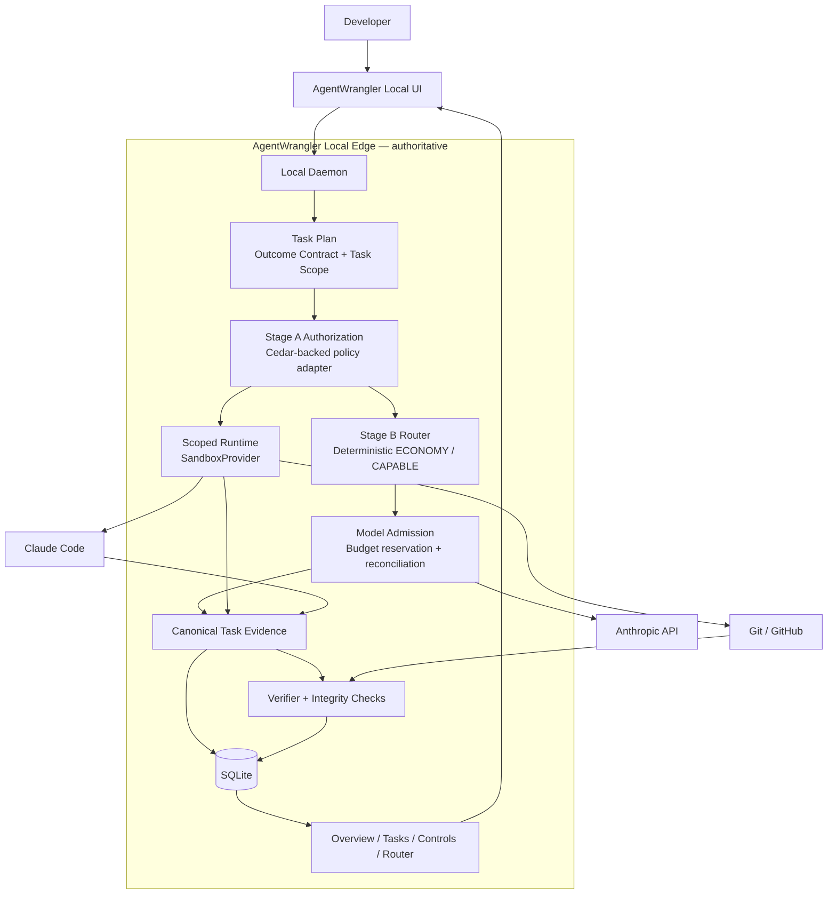

<p align="center">
  
</p>

<h1 align="center">AgentWrangler</h1>

<p align="center">
  <strong>Wrangle your agents before they wrangle your repo.</strong>
</p>

<p align="center">
  An open-source, local-first control plane for AI coding agents.
</p>

> **Status: design / pre-alpha**
>
> AgentWrangler is currently validating its P0 architecture and security boundaries.  
> The README describes the intended product and implementation direction — not a claim that every feature below is already complete or production-ready.

---

## What is AgentWrangler?

AI coding agents can now modify repositories, call tools, consume model APIs, and interact with external systems. The controls around those agents are still fragmented across agent settings, model providers, operating-system permissions, Git hosting, CI, and developer supervision.

**AgentWrangler** is designed to put one local control-and-evidence layer around that workflow.

For the first release, the goal is intentionally narrow:

> **Run Claude Code on one repository with bounded authority, governed model spend, independent verification, and a clear local dashboard showing whether the work succeeded and what that success cost.**

AgentWrangler is **not another coding agent**. It sits around an existing agent and coordinates:

- what the agent is allowed to do;
- which actions require approval;
- what runtime protections are actually active;
- which governed model may be used;
- how much the task is allowed to spend;
- what happened during execution;
- whether the requested outcome was independently verified;
- whether the verification mechanism itself remained trustworthy; and
- what the verified result cost in time and model usage.

---

## Why build this?

First off, I like to design and build things to understand them better. I also couldn't find a tool that solves these problems cohesively.

Overall, the tool is aimed at solving these challenges from AI agents:

**Authority** — What is this task allowed to change or access?

**Enforcement** — Can those limits actually be enforced, or are they only advisory?

**Cost** — Which model is being used, and can runaway model spend be stopped?

**Evidence** — What did the agent actually do?

**Verification** — Did the requested outcome succeed independently of the agent saying it did?

AgentWrangler treats these as separate systems instead of collapsing them into a single “agent safety” switch.

The guiding principle is:

> **AI may decide what is likely to work. Deterministic policy decides what is allowed.**

---

## P0: the smallest useful vertical slice

The initial Full Governance path is deliberately opinionated:

```text
one developer
+
Claude Code
+
BYOK Anthropic API access
+
one local Git repository with a GitHub remote
+
one validated Linux-family scoped-runtime profile
+
repository-native verification and/or trusted GitHub Actions
+
local AgentWrangler dashboard
```

P0 uses two certified Claude model aliases:

- `ECONOMY`
- `CAPABLE`

The built-in router is deterministic. It can start with the economy model and escalate once when an allowed capability condition is met, while keeping provider/network retries separate from model-capability escalation.

### P0 is intentionally not

- a universal coding-agent platform;
- a generic LLM gateway;
- a new policy language;
- a custom kernel sandbox;
- a cloud control plane;
- a generalized analytics warehouse;
- a recommendation engine;
- a cross-provider Claude Code router; or
- an enterprise IAM / fleet-management product.

Those boundaries are features, not omissions. The project first needs evidence that the core control-and-verification loop is useful.

---

## Architecture



The local edge is authoritative for P0. There is no AgentWrangler cloud service in the synchronous control path.

---

## The control loop

A protected task is intended to follow this sequence:

1. **Discover the workspace**  
   Resolve the repository, branch, verification commands, relevant paths, and supported runtime capabilities.

2. **Define what “done” means**  
   Create a versioned **Task Outcome Contract** with observable acceptance criteria.

3. **Approve bounded authority**  
   Create a **Task Scope** describing the capabilities the task is expected to need.

4. **Authorize consequential actions**  
   **Stage A** evaluates normalized actions and resources using deterministic policy.

5. **Choose a governed model path**  
   **Stage B** selects an allowed model alias using a small deterministic router.

6. **Admit model spend**  
   **ModelAdmission** reserves budget before dispatch and reconciles actual usage afterward.

7. **Run inside a validated scoped runtime**  
   AgentWrangler wraps an upstream sandbox rather than inventing one.

8. **Collect canonical task evidence**  
   Routing, approvals, model usage, relevant Git/tool effects, and verification evidence remain correlated to the task.

9. **Verify independently**  
   Verification is performed against the candidate result while checking that the verifier itself was not silently weakened.

10. **Show the result locally**  
    The dashboard reports outcome, cost, timing, first-route success, verification coverage, and relevant failure attribution.

---

## Truthful protection reporting

AgentWrangler does not treat “protected” as a single boolean.

P0 reports individual capabilities such as:

- workspace filesystem enforcement;
- network-scope enforcement;
- host-credential withholding;
- child-tool isolation;
- model-gateway control; and
- brokered GitHub authority.

If a capability is unsupported or degraded, the UI should say so.

A wrapper, shell alias, dashboard setting, or policy rule is **not** presented as an enforcement boundary unless the active runtime/provider path can actually prevent the action.

---

## What AgentWrangler owns vs. reuses

AgentWrangler should own the **product semantics** that make the control loop useful:

- Task Outcome Contracts;
- Task Scope and approval semantics;
- normalized action/resource authorization;
- deterministic routing policy;
- task-scoped model admission and budget accounting;
- task-centric evidence correlation;
- verifier-integrity semantics;
- trustworthy outcome classification; and
- the user-facing explanation of protection state.

Where mature primitives already exist, the project should reuse them behind replaceable interfaces.

Current implementation direction includes:

| Capability | Direction |
|---|---|
| Authorization evaluation | Cedar-backed `PolicyEngine` adapter |
| Runtime isolation | Evaluate `nono` and Anthropic Sandbox Runtime behind `SandboxProvider` |
| Secrets | OS-protected credential storage |
| GitHub actions | Existing Git / GitHub CLI or provider tooling behind AgentWrangler authorization |
| Generic telemetry | OpenTelemetry SDK / semantic conventions where useful |
| Local state | SQLite |
| Model path | Narrow Anthropic-compatible ModelAdmission path first |

A future dependency should be added because it **reduces total custom complexity**, not simply because it exists.

---

## P0 dashboard

The first local dashboard has four surfaces:

### Overview

Answers:

> **Are protected tasks succeeding, what does success cost, and is cheap-first routing working?**

Core metrics include:

- Trustworthy Verified Success Rate;
- Cost per Trustworthy Verified Success;
- Median Time to Verified Outcome;
- First-Route Success Rate;
- Verification Coverage; and
- total observed model spend.

### Tasks

Drill into an individual task:

- Task Plan;
- Outcome Contract;
- Task Scope;
- route history;
- model usage;
- approvals;
- failure attribution;
- verification evidence; and
- chronological task evidence.

### Controls

Shows the controls that are actually active:

- protection capabilities;
- policy state;
- task-scope grants;
- model/spend limits;
- connection state; and
- containment / Stop Agent status.

### Router

Shows factual P0 routing evidence:

- model alias distribution;
- routing reason codes;
- first-route success;
- retries vs. capability escalations;
- override behavior;
- failure categories; and
- observed pre-escalation waste.

No calibrated success prediction, recommendation engine, or counterfactual “savings” claims are required for P0.

---

## Metrics are evidence, not decoration

AgentWrangler's north-star economic measure is:

> **Cost per trustworthy verified successful task**

That number only means something if “success,” cost eligibility, verification coverage, and failure attribution are defined consistently.

P0 therefore versions its metric definitions and keeps:

- provider/service failures separate from model-reasoning failures;
- partial or unavailable observations separate from exact observations;
- failed/retried attempts in the economics of the task when they contributed to the outcome path; and
- factual observed waste separate from hypothetical counterfactual savings.

The project deliberately avoids a universal “agent quality score.”

---

## Roadmap

The roadmap is evidence-gated. A future phase is **not permission to pre-build its infrastructure during P0**.

| Phase | Focus |
|---|---|
| **Architecture spikes** | Validate proxy compatibility, policy embedding, sandboxing, budget correctness, constrained GitHub access, and clean verification |
| **P0 — vertical slice** | Claude Code + Anthropic BYOK + one repo + deterministic policy/routing + budget controls + evidence + verification + local dashboard |
| **P1 — evidence-informed breadth** | Codex/OpenAI path, Native Login compatibility, more validated model/provider/OS profiles, more verifier families, learned-router experiments, Performance analytics when justified |
| **P2 — optimization / cloud** | Durability/rework attribution, recommendations, versioned config experiments, replay, remote history, cross-device views |
| **P3 — team / enterprise** | Organizations, central policy, shared approvals, SSO/RBAC, SIEM/retention, federation, fleet management |

### Evidence-gated analytics candidates

Some potentially useful analytics are intentionally **not committed P1 scope**:

- provider reliability workbench;
- token/context efficiency and loop-waste analysis; and
- governance-effectiveness analytics.

They should only be promoted when P0 evidence shows a recurring user decision they can materially improve.

---

## Design principles

1. **Local enforcement first**  
   P0 should continue working without a cloud service.

2. **Fail closed where AgentWrangler claims enforcement**  
   Errors in a security-critical authorization path must not become accidental permission.

3. **Keep secrets out of the general agent runtime**  
   Credentials should be narrowly scoped and exposed only where required.

4. **Do not confuse policy with enforcement**  
   A rule is useful only when an active boundary can enforce it.

5. **Do not trust the agent to grade itself**  
   Agent claims are evidence, not ground truth.

6. **Protect the verifier**  
   A green test result is not trustworthy if the task silently weakened the mechanism used to judge success.

7. **Prefer deterministic P0 behavior over premature intelligence**  
   Learned routing, calibration, recommendations, and replay come after trustworthy evidence exists.

8. **Reuse infrastructure; own semantics**  
   Do not rebuild gateways, policy evaluators, sandboxes, databases, or telemetry stacks without a strong reason.

9. **No future-platform tax in P0**  
   Interfaces and roadmap entries should not become pre-built services, workers, tables, or cloud infrastructure.

---

## Project documents

The current design baseline is:

- [Product Requirements Document — v0.6.2](./docs/AgentWrangler_PRD_v0_6_2.md)
- [Technical Architecture — v4.4.2](./docs/AgentWrangler_Technical_Architecture_v4_4_2.md)

These documents are intentionally more detailed than this README and are the source of truth for implementation decisions.

---

## Contributing

AgentWrangler is currently in the architecture / pre-alpha stage.

Contributions are especially useful when they:

- reduce the amount of custom security-sensitive code;
- validate or falsify an architecture assumption;
- improve tests around an existing security boundary;
- simplify the P0 user experience;
- make protection claims more precise;
- improve independent verification; or
- demonstrate that a proposed P1+ feature is justified by real P0 evidence.

Before implementing a large feature, please check the PRD and technical architecture to determine:

1. what user problem it solves;
2. whether it is actually P0 scope;
3. which upstream and downstream requirements it affects;
4. whether an existing open-source primitive already solves the low-level problem; and
5. what observable success criteria will prove the change works.

Large new subsystems should begin with an architecture decision rather than implementation by momentum.

---

## Security

AgentWrangler is **pre-alpha security software**.

Do not rely on the current project for production isolation, credential protection, or enforcement until the relevant protection profile has been implemented, tested, and explicitly documented as supported.

If you discover a security vulnerability, **please do not publish exploit details in a public issue**. Use GitHub's private vulnerability-reporting / Security Advisory mechanism when available, or contact the maintainers privately.

Security claims in the project should always identify the boundary that actually enforces them.

---

## License

AgentWrangler is intended to be open source, but the final repository/package license is still **TBD**.

Until a license is selected and added to the repository, do not assume permissions beyond those granted by applicable law.

---

<p align="center">
  <strong>AgentWrangler</strong><br>
  Keep the agent useful. Keep the boundaries real.
</p>
