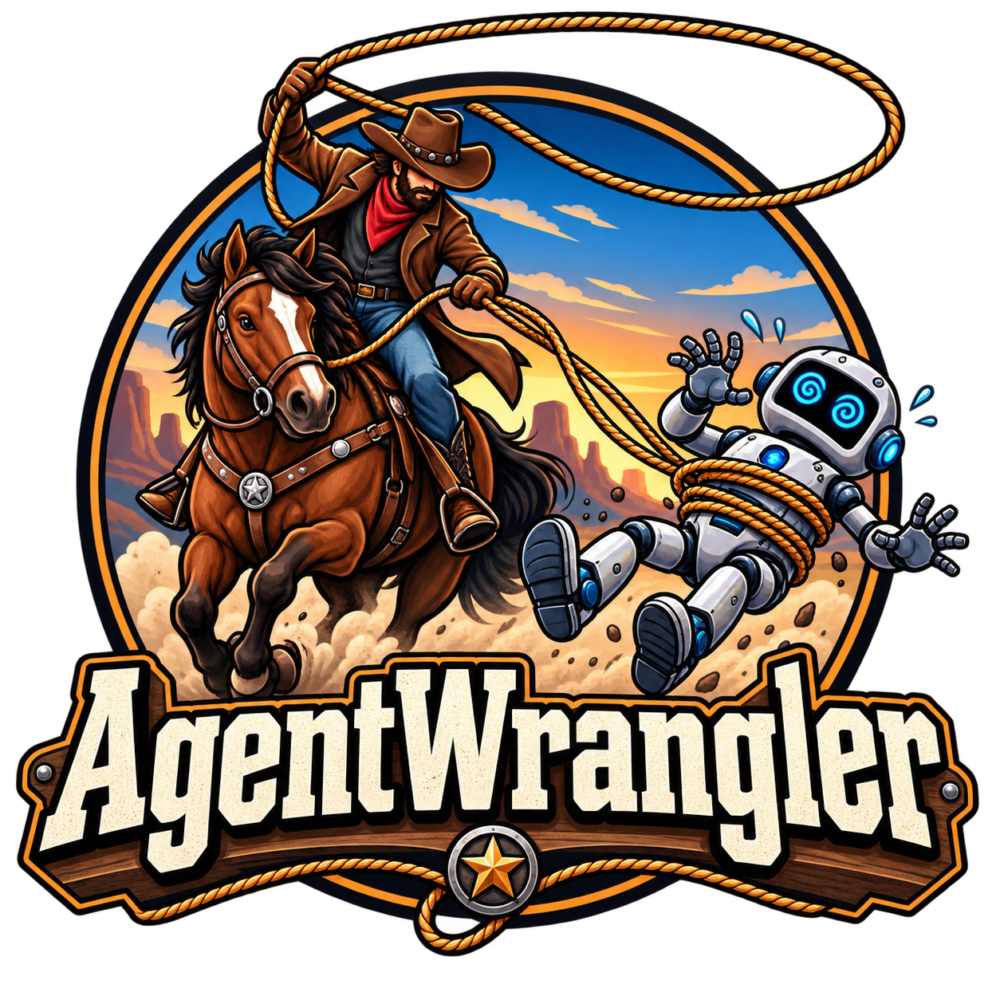

  

<h1 align="center">AgentWrangler</h1>

  <strong>See where your coding agent spends — then cut the waste, not the results.</strong>

  A local, privacy-preserving observability tool for Claude Code token spend and session outcomes.

> **Status: design / pre-alpha.** This README describes the intended product and current direction —
> not a claim that every feature below is complete or production-ready.

---

## What is AgentWrangler?

AgentWrangler watches your normal, interactive Claude Code usage across all your local workspaces and
answers three questions:

1. **What is my agent usage costing** — live and over time, by workspace / session / model / turn?
2. **Is the work actually succeeding** — including work the agent created but deferred?
3. **What specific, evidence-backed changes would cut spend without cutting success — and did they work
   after I adopted them?**

The daemon runs on `127.0.0.1` and serves a web UI in your browser. It streams your
`~/.claude/projects/**/*.jsonl` transcripts, stores **derived metadata only** in local SQLite (never
prompt or code content), and surfaces cost trends, session hygiene, GitHub outcome linkage, and
recommendations. **No cloud. No data leaves your machine.**

> **Run Claude Code exactly as you do today.** AgentWrangler shows spend and burn across every workspace,
> links sessions to observed outcomes (merged PRs, CI, review debt), and produces recommendations whose
> impact is *measured*, not asserted.

---

## Principles

- **Evidence over assertion.** Every number has a versioned definition, an explicit denominator, and
  drill-down to its contributing rows (global → workspace → session → turn).
- **Truthful claims.** Costs computed from transcripts are labeled **cost-equivalent (API list price)**,
  never "billed," unless a billing source is connected. Outcomes are labeled *observed*, not *verified*.
- **The resource is rate-limit headroom, not raw tokens.** Cache reads draw against the weekly cap at the
  cached rate (~0.1×), so savings are valued **cap-weighted** and anchored on $/week — never a raw token
  count.
- **Modeled vs measured.** A recommendation's projected savings are *modeled*; only a post-adoption delta
  is *measured*. The two are never mixed.
- **Observation only.** The MVP never blocks, routes, sandboxes, or modifies agent behavior.

---

## Dashboard

**Global → Workspace → Session**, plus Recommendations and Settings.

- **Overview** — 7-day spend, weekly-limit burn forecast, observed success rate, context-per-turn trend,
  a workspace comparison table, and a live strip of currently active sessions.
- **Workspaces** — per-workspace spend, session hygiene, linked work items / outcomes, and deferred-review
  backlog *(EXPERIMENTAL)*.
- **Recommendations** — evidence-backed proposals with modeled savings, an impact ledger (modeled vs
  realized), and an on-demand "Analyze with Claude" action. See
  [Recommendations Engine (overview)](./docs/recommendations-engine-overview.md).
- **Settings** — transcript roots, workspace→repo mapping, GitHub connection (read-only), pricing-snapshot
  status, weekly-limit configuration, and privacy toggles (content inclusion default-off).

---

## Privacy by construction

- The metrics database stores derived metadata only — counts, sizes, timings, ids, hashes — **never**
  prompt, code, or model-response content.
- Transcript files are read in place; AgentWrangler never modifies, moves, or re-permissions them.
- The only network egress is the read-only GitHub sync, explicit "Analyze with Claude" runs, and an
  optional pricing refresh — each visible in Settings.

---

## Project documents

- **[Product Requirements Document — v0.7.2](./docs/AgentWrangler_PRD_v0_7_2.md)** — the source of truth
  for the Observe MVP.
- **[Recommendations Engine (overview)](./docs/recommendations-engine-overview.md)** — how the detector /
  recommendation engine works.

### Background: the earlier control-plane design (now planned as "P1 — Govern")

AgentWrangler began as a local *control plane* for coding agents (bounded authority, governed spend,
independent verification). That design is **preserved as the future P1 "Govern" layer** and is promoted
only once the Observe MVP proves value. It is kept for reference:

- [PRD — v0.6.2 (control-plane design, now P1)](./docs/AgentWrangler_PRD_v0_6_2.md)
- [Technical Architecture — v4.4.2 (now P1)](./docs/AgentWrangler_Technical_Architecture_v4_4_2.md)

---

## Contributing

AgentWrangler is in the design / pre-alpha stage. Contributions are especially useful when they validate
or falsify a measurement assumption, improve the accuracy of spend attribution or outcome linkage, or
sharpen an honesty label. Please check the PRD to see what problem a change solves and what observable
criteria would prove it works.

---

## Security & privacy

This is pre-alpha software. If you discover a security or privacy issue, please **do not** publish details
in a public issue — use GitHub's private vulnerability-reporting / Security Advisory mechanism, or contact
the maintainers privately.

---

## License

Licensed under the [Apache License 2.0](LICENSE). Copyright 2026 AgentWrangler contributors.

---

  <strong>AgentWrangler</strong> 
  See the spend. Cut the waste. Keep the results.

