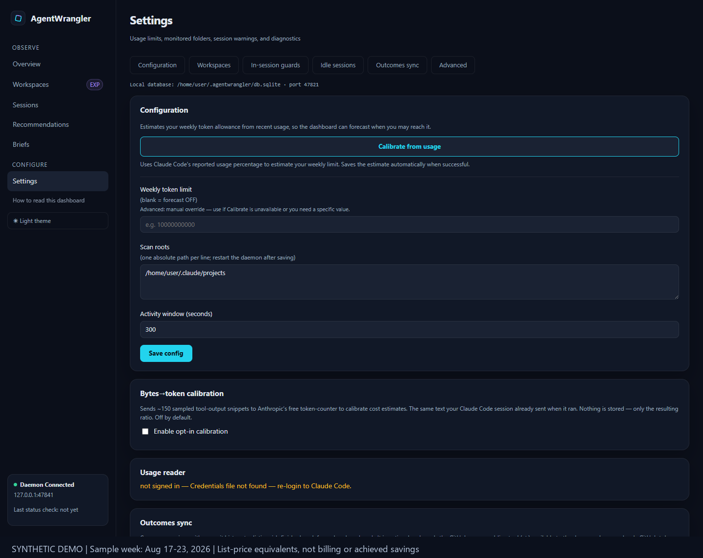
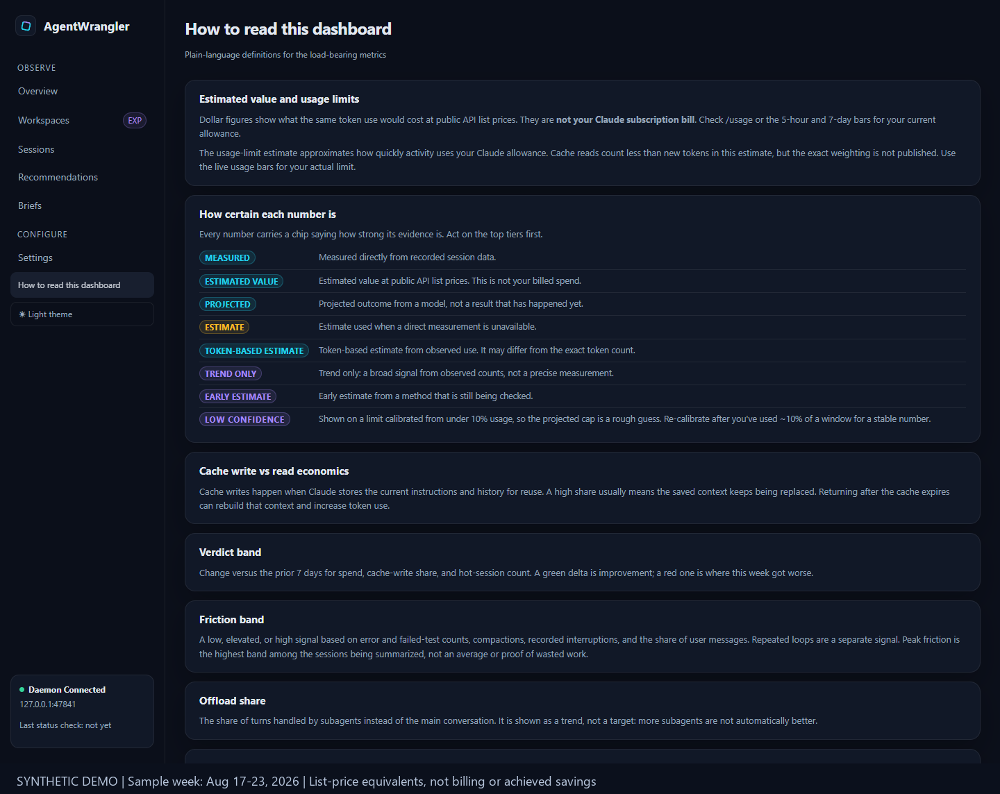

# Dashboard tour

Every tab of the AgentWrangler dashboard, in the order the sidebar lists them, plus the
vocabulary the UI uses. For plain-language metric definitions, the dashboard itself ships a
glossary — sidebar → **"How to read this dashboard."**

<!--
  Screenshots on this page are captured from a SANITIZED instance (Vite test-mode fixtures —
  anonymized names, no live data) so no real workspace/repository names or paths are committed
  (SEC-101). Regenerate against `npx vite --mode test`.
-->

## Choose a workflow

- **Where did the tokens go?** Start with [Workspaces](#workspaces), then [Sessions](#sessions).
- **What can I change, and did it help?** Follow the [worked recommendation example](getting-started.md#example-trim-always-loaded-context), then inspect [Recommendations](#recommendations).
- **What do the numbers mean?** Use the [glossary](#glossary-how-to-read-this-dashboard).
- **Why is my dashboard empty?** Check [first launch and scan state](getting-started.md#first-launch).

Animated synthetic dashboard walkthrough (optional)

The screenshots and animation use the same synthetic heavy-use scenario: roughly $3,100
in weekly list-price equivalents and 19,400 turns across anonymized workspaces. These are
illustrative values, not a subscription bill or a promise of savings. The context-reduction
estimate uses removable tokens, observed turns, and a cache-read price; it is a projection.
The ledger shows separate seeded measurement examples, not the result of actions in the tour.

The animation holds seven scenes for 5–7 seconds each: Overview, limits and hot sessions,
Workspaces, session detail, a proposed context change, its evidence, and the Impact ledger.
The static images below provide an alternative to animation.

To reproduce the media, start an isolated `npx vite --mode test --host 127.0.0.1 --port 47841 --strictPort`
and use `scripts/demo/capture.js` with Playwright CLI, followed by `scripts/demo/compose.py`.
The capture script fixes the clock to the historical sample week; screenshots carry a
synthetic-data footer. Capture only the fixture instance.

## Overview

*Where your tokens go · burn forecast · live sessions.*

- **At-a-glance verdict** — the window's list-price-equivalent spend, a trend sparkline, a
  "material change vs. prior" badge, and your **top waste source** with a copyable fix prompt
  and a deep link to the matching recommendation.
- **Rate-limit gauges** — live 5-hour and 7-day utilization with reset times.
- **Burn forecast** — projects your spend against the calibrated weekly limit (OFF until you
  calibrate in Settings).
- **Hot sessions** — the top three sessions by cost, one click from their detail pages.
- **Where your tokens go** — spend-over-time chart, cache-efficiency KPI, token-flavor
  decomposition (input / output / cache write / cache read), and a cache-write spikes chart.
- **Context / Turn** — per-model tiles showing average context per turn and the
  output-to-context ratio.
- **Top workspaces** — spend, share, live-now indicator, $/turn, and each workspace's top
  waste source.
- Date presets: **24h / 7d / 30d**. A first-run onboarding card tracks daemon → first ingest →
  scan completion. An empty history or completed scan without recommendations is valid; optional setup is not required.

A standing caveat banner keeps the economics honest: dollar figures are list-price
equivalents — subscription plans are not billed this way; tokens drive rate limits.

## Workspaces

*Spend efficiency by repository.*

Columns: spend, share (inline bar), trend sparkline, context/turn, cache-write %, Opus %,
$/turn, and an experimental **success rate** when outcome linkage is on. A toggle reveals
transient (one-off directory) workspaces.

**Workspace detail** adds top sessions, a context-composition panel, and the outcomes table —
merged/closed PRs linked to the sessions that produced them, closure proxy, and
cost-per-success.

## Sessions

*Highest-cost sessions with output / context split.*

Each row: cost with an inline bar, a **"top X% by spend"** self-percentile chip, the
output-to-context average, model, turns, a **friction band** (low / elevated / high — from API
errors, tool errors, test failures, compactions, reprompts, and long gaps), and last-active
time.

**Session detail** shows per-session KPIs (cost, $/turn, context/turn, duration, hygiene
flags, turns-to-first-commit), a turn-by-turn timeline chart, and **cost drivers** — the
detectors that fired on this session with their measured shares — plus a guided fix prompt
assembled only from measured context.

## Recommendations

*Waste-source detectors · ranked by type of impact, then estimated savings.* (Labeled
EXPERIMENTAL — estimates are not yet validated.)

The detector families:

| Detector | Watches for |
|---|---|
| Cache misses | Broken prompt-cache reuse — flagged as the biggest single lever (~10× the impact of memory trims) |
| Session hygiene | Long sessions never `/clear`ed, mid-task compactions |
| Retry / redundant-read | Loops re-reading the same files or repeating failing calls |
| Tool-result bloat | Oversized tool outputs re-read every turn |
| Model routing | Opus turns doing Sonnet-shaped work |
| Limit warning | Burn pace vs. your weekly limit |
| Background sessions | Idle sessions still burning tokens |
| CLAUDE.md / memory | Oversized always-on instruction files |
| Tool catalog | Heavy MCP tool definitions loaded every turn |

Cards carry a confidence tier (**WARNING / ADVISORY / DIRECTIONAL / MODELED SAVINGS**), a
scope badge (global vs. workspace-scoped), and per-card actions: **Track this change** after
the required action evidence and confirmation, **Acknowledge** for unmeasured warnings,
**Dismiss/snooze**, **Install hook**, **Copy snippet**, **Copy prompt**, or **Open in Claude
Code**. Tracking records a baseline; it does not prove effectiveness and has no post-track undo.
Below the cards: a published-best-practices scorecard, the **impact ledger** ("Adopted
changes — measured effect"), the dismissed cool-down list, and a detector-coverage strip.

The standing rule: *modeled savings are never counted as achieved; only verified measured
effects contribute to the achieved total.*

## Briefs

*This week in one page: verdict, what changed, what to do.*

Week-over-week deltas for spend, cache-write share, and hot sessions; the top recommended
actions with per-action copyable prompts; an expandable attribution section; a global or
per-workspace scope selector; and **Copy as Markdown** for standups.

## Settings

*Daemon config · workspace mappings · parser health.*

- **Configuration** — calibrate the weekly token limit from live usage (one click,
  auto-saves), or override manually; scan roots; activity window.
- **Bytes→token calibration** — opt-in, off by default (see [Privacy](privacy.md)).
- **Workspace mappings** — edit repo path / canonical name per workspace.
- **Parser health** — read-only ingestion counters.
- **Usage reader** — uses the existing Claude Code OAuth sign-in to call Anthropic's usage
  endpoint for live rate-limit state; it does not upload transcript text.
- **Outcomes sync** — with a GitHub token, reads outcome metadata at startup and on the scheduled
  pass; without a token it makes no GitHub requests.
- **In-session guards** — direct install adds five hooks; the copied prompt adds context-budget,
  loop, and burn only. Context-budget and burn warn, loop can deny repeated failures, and the
  direct-only dangerous-command guard can ask or deny. The direct-only PreCompact hook can make
  local raw-transcript checkpoint copies; see [Privacy](privacy.md#raw-transcript-checkpoint-copies).
- **Danger zone** — type-to-confirm database reset.

## Glossary ("How to read this dashboard")

Plain-language definitions for every key metric, rendered with the same chip
components the rest of the UI uses:

- **Honesty tiers** — `EXACT` (counted), `LIST_EQUIV` (list-price equivalent), `MODELED`,
  `PROXY` / `OBS_PROXY`, `DIRECTIONAL`, `EXPERIMENTAL`, `LOW CONFIDENCE`.
- **Cap-weighted meter** — cache reads count far less against your rate limit than fresh
  input; the meter weights flavors accordingly.
- **Cache write vs. read economics**, **verdict band**, **friction band**, **offload share**,
  **self-percentiles**, and **linkage coverage**.
